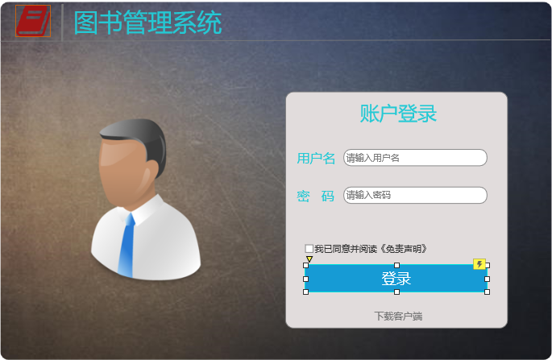
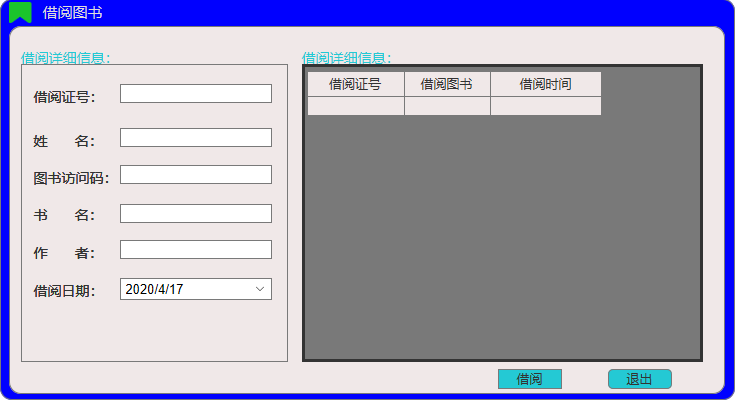
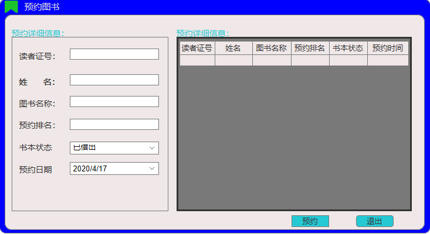
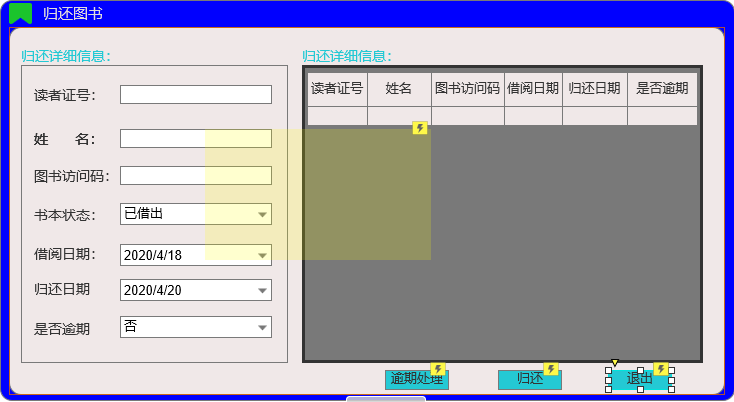
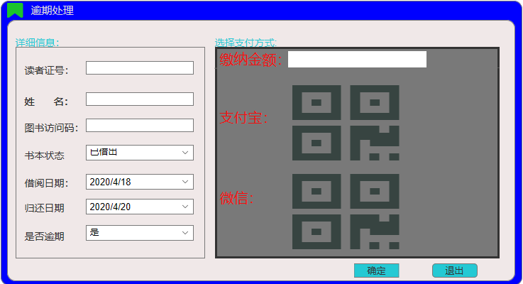
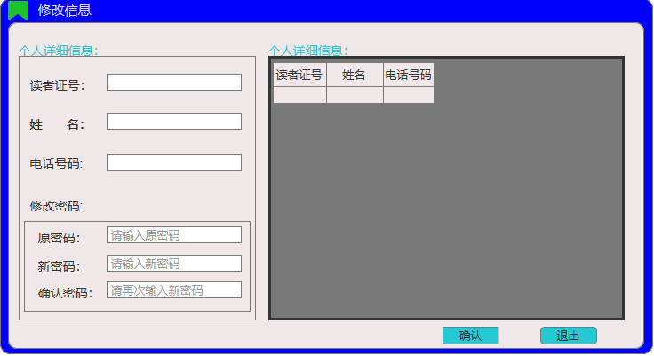

# 实验5：图书管理系统数据库设计与界面设计
## 1.数据库表设计
### 1.1图书表
<table>
<tr>
 <td>字段</td>
 <td>类型</td>
 <td>主键,外键</td>
 <td>可以为空</td>
 <td>默认值</td>
 <td>约束</td>
 <td>说明</td>
</tr>
<tr>
   <td>BookID</td>
   <td>varchar10</td>
   <td>主键</td>
   <td>否</td>
   <td></td>
   <td>主键</td>
   <td>书号</td>
</tr>
<tr>
   <td>BookName</td>
   <td>varchar10</td>
   <td></td>
   <td>否</td>
   <td></td>
   <td></td>
   <td>书名</td>
</tr>
<tr>
   <td>PublishCode</td>
   <td>varchar10</td>
   <td></td>
   <td>否</td>
   <td></td>
   <td></td>
   <td>出版号</td>
</tr>
<tr>
   <td>PublisherName</td>
   <td>varchar10</td>
   <td></td>
   <td>否</td>
   <td></td>
   <td></td>
   <td>出版社名</td>
</tr>
<tr>
   <td>author</td>
   <td>varchar10</td>
   <td></td>
   <td>是</td>
   <td></td>
   <td></td>
   <td>作者</td>
</tr>
</table>

### 1.2读者表
<table>
<tr>
 <td>字段</td>
 <td>类型</td>
 <td>主键,外键</td>
 <td>可以为空</td>
 <td>默认值</td>
 <td>约束</td>
 <td>说明</td>
</tr>
<tr>
   <td>CardID</td>
   <td>varchar10</td>
   <td>主键</td>
   <td>否</td>
   <td></td>
   <td>主键</td>
   <td>读者号</td>
</tr>
<tr>
   <td>Name</td>
   <td>varchar10</td>
   <td></td>
   <td>否</td>
   <td></td>
   <td></td>
   <td>姓名</td>
</tr>
<tr>
   <td>Sex</td>
   <td>varchar10</td>
   <td></td>
   <td>否</td>
   <td></td>
   <td></td>
   <td>性别</td>
</tr>
<tr>
   <td>Dept</td>
   <td>varchar10</td>
   <td></td>
   <td>是</td>
   <td></td>
   <td></td>
   <td>部门</td>
</tr>
</table>

### 1.3借还表
<table>
<tr>
 <td>字段</td>
 <td>类型</td>
 <td>主键,外键</td>
 <td>可以为空</td>
 <td>默认值</td>
 <td>约束</td>
 <td>说明</td>
</tr>
<tr>
   <td>CardID</td>
   <td>varchar10</td>
   <td>外键</td>
   <td>否</td>
   <td></td>
   <td>外键</td>
   <td>读者号</td>
</tr>
<tr>
   <td>BookID</td>
   <td>varchar10</td>
   <td></td>
   <td>否</td>
   <td></td>
   <td></td>
   <td>书号</td>
</tr>
<tr>
   <td>Name</td>
   <td>varchar10</td>
   <td></td>
   <td>否</td>
   <td></td>
   <td></td>
   <td>姓名</td>
</tr>
<tr>
   <td>BorrowDtae</td>
   <td>datetime</td>
   <td></td>
   <td>否</td>
   <td></td>
   <td></td>
   <td>借书日期</td>
</tr>
<tr>
   <td>BackDtae</td>
   <td>datetime</td>
   <td></td>
   <td>否</td>
   <td></td>
   <td></td>
   <td>还书日期</td>
</tr>
</table>

### 1.4预约表
<table>
<tr>
 <td>字段</td>
 <td>类型</td>
 <td>主键,外键</td>
 <td>可以为空</td>
 <td>默认值</td>
 <td>约束</td>
 <td>说明</td>
</tr>
<tr>
   <td>CardID</td>
   <td>varchar10</td>
   <td>外键</td>
   <td>否</td>
   <td></td>
   <td>外键</td>
   <td>读者号</td>
</tr>
<tr>
   <td>Name</td>
   <td>varchar10</td>
   <td></td>
   <td>否</td>
   <td></td>
   <td></td>
   <td>姓名</td>
</tr>
<tr>
   <td>Pdate</td>
   <td>datetime</td>
   <td></td>
   <td>否</td>
   <td></td>
   <td></td>
   <td>预约时间</td>
</tr>
<tr>
   <td>BookID</td>
   <td>varchar10</td>
   <td></td>
   <td>否</td>
   <td></td>
   <td></td>
   <td>书号</td>
</tr>
<tr>
   <td>BookName</td>
   <td>varchar10</td>
   <td></td>
   <td>否</td>
   <td></td>
   <td></td>
   <td>书名</td>
</tr>
</table>

## 2.界面设计
### 2.1登陆界面设计

- 用例图参见：借书用例
- 类图参见：借书类，读者类
- 顺序图参见：借书顺序图
- API接口如下：

1.获取全部分类
### 2.2主界面设计

### 2.3借阅界面设计

### 2.4预约界面设计

### 2.5还书界面设计

### 2.6逾期处理界面设计

### 2.7修改个人信息界面设计
